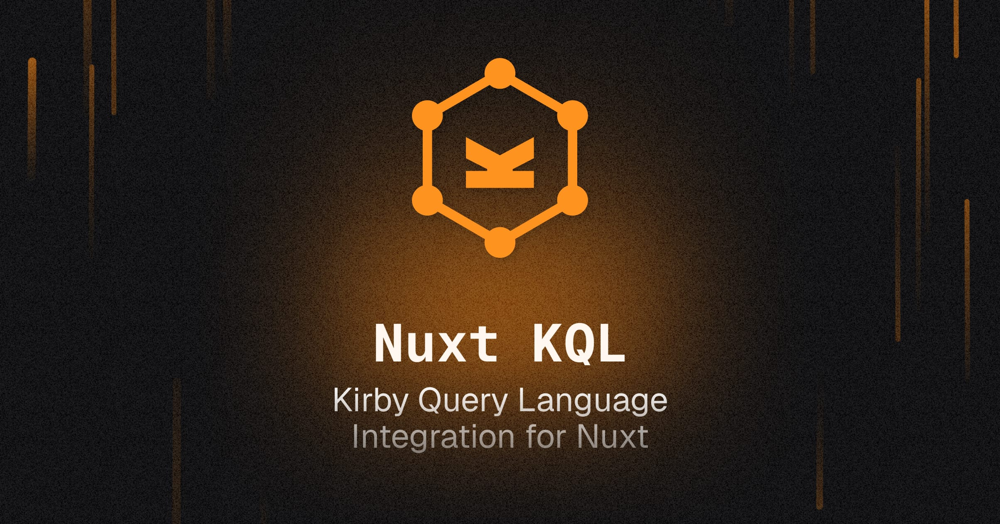

[](https://nuxt-kql.byjohann.dev)

# nuxt-kql

[](https://www.npmjs.com/package/nuxt-kql)

> [Nuxt](https://nuxt.com) module for [Kirby's Query Language](https://github.com/getkirby/kql) API.

- [✨ &nbsp;Release Notes](https://github.com/johannschopplich/nuxt-kql/releases)
- [📖 &nbsp;Read the documentation](https://nuxt-kql.byjohann.dev)

## Features

- 🔒 Protect your Kirby credentials when sending queries
- 🪢 Supports token-based authentication with [Kirby Headless Starter](https://github.com/johannschopplich/kirby-headless-starter) (recommended)
- 🤹 No CORS issues!
- 🍱 Handle request just like with the [`useFetch`](https://nuxt.com/docs/getting-started/data-fetching/#usefetch) composable
- 🗃 Cached query responses
- 🦾 Strongly typed

## Setup

> [📖 Read the documentation](https://nuxt-kql.byjohann.dev)

```bash
# pnpm
pnpm add -D nuxt-kql

# npm
npm i -D nuxt-kql
```

## Basic Usage

> [📖 Read the documentation](https://nuxt-kql.byjohann.dev)

Add `nuxt-kql` to your Nuxt config:

```ts
// `nuxt.config.ts`
export default defineNuxtConfig({
  modules: ['nuxt-kql']
})
```

And send queries in your template:

```vue
<script setup lang="ts">
const { data, pending, refresh, error } = await useKql({
  query: 'site',
})
</script>

<template>
  <div>
    <h1>{{ data?.result?.title }}</h1>
    <pre>{{ JSON.stringify(data?.result, undefined, 2) }}</pre>
  </div>
</template>
```

## 💻 Development

1. Clone this repository
2. Enable [Corepack](https://github.com/nodejs/corepack) using `corepack enable`
3. Install dependencies using `pnpm install`
4. Run `pnpm run dev:prepare`
5. Start development server using `pnpm run dev`

## License

[MIT](./LICENSE) License © 2022-2023 [Johann Schopplich](https://github.com/johannschopplich)
